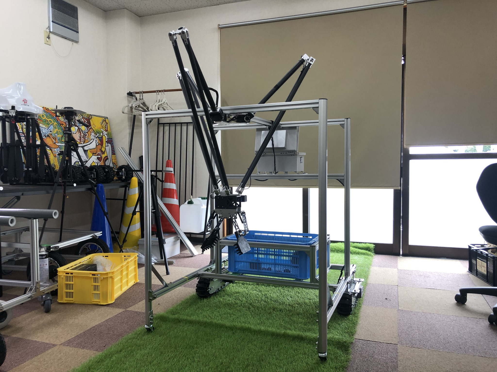

# Chestnut-Picker

This project is a combination of UGV, robot manipulator (delta robot) and AI object detection to perform a chestnut-picking task. 

## Hardware
- Jetson Nano 2GB
- U2D2 (Dynamixel USB converter)
- Robot Manipulator
	- XM540-W270-R 3pcs for linkage
	- XM430-W350-R 1pc for gripper
	- aluminum + carbon parts
- Logicool C930e webcam (with 3D printed case)
- GL-iNet Wifi router
- 15V dc-dc regulator
- 5V dc-dc regulator
- Futaba T6K radio transmitter and receiver
- AT_JMOAB01 for Jetson and electronic device interfaces
- DC motor for crawler wheels
- Li-ion battery

## AT_JMOAB
We are developing the interface board which can sit on J41 pin of Jetson Nano or NX dev kit board, the board is called "JMOAB". It could receive SBUS input from Futaba receiver and output 4 channels of PWM signal. In our case, we are using PWM1 for left wheel, and PWM2 for right wheel driver.

For more information about JMOAB, please check on this [repo](https://github.com/rasheeddo/jmoab-ros).

## Robot Manipultor

This robot configuration is 3DOF Parallel Linkage "Delta" Robot, it's well known in manufacturing process for speed-picking. For more detail and dimensions please check on this [repo](https://github.com/rasheeddo/The-Delta-Robot-MK2-Cpp).

The inverse kinematics are same on that repo and this repo, the different are robot working range, servo's PIDs, limitation and some functions. You can check more detail of robot setup on `DeltaRobot.py`.

## UGV control

The robot operation is mainly controlled by user from Futaba transmitter.

In manual mode (ch5 is M), we can use throttle and steering sticks to control the UGV movement. When moving the UGV in manual it's better to disable the robot movement by switching ch6 to ARM OFF.

In auto mode (ch6 is A), please makre sure you bring ch6 to ARM ON to let the robot operates correctly.

## Software

I am using ROS to make the robot programming a lot easier with every nodes running in parallel. 
There are three nodes
- jmoab-ros-pwmcart
- tensorrt chestnut detection
- chestnut picker main code

The UGV and radio interfaces are taken care by jmoab-ros. You will see related topics as
- `/sbus_cmd`: to send sbus commands (steering/throttle)
- `/sbus_rc_ch`: to read radio channels

The AI detection is taken care by tenssort_ros, this is a modifed version of tensorrt_demos from [this guy](https://github.com/jkjung-avt/tensorrt_demos). I modified the code to make it run on python2 with ros support. You will see related topics as
- `/detection`: a custom message which show number of boxes, and center pixels of object
- `/trt_streaming`: an image topic to debug/visualize what's the robot seeing right now.

The robot manipulator movement node is subscribing on topics above and perform autonomous drive and picking. The main file is `chestnut_picker_demo.py` .

Once the robot got power, please make sure to put the robot arm on empty space or on the ground, it would take around 2 minutes to start Wifi router and ensure everything is running properly, then you will see the robot is moving up to home position by itself.

**NOTE**
Normally the robot will automatically start once it got power on, the start up scripts are in `autostart_scripts` directory. If you don't want the robot to be auto-start, you can remove the start file with this command below.

`rm ~/.config/autostart/start_all.desktop`
`reboot`

If you remove this and want to make it auto-start again, please run the command below.

`cd /home/nvidia/chestnut_picker_ros/autostart_scripts/_config_autostart`
`cp start_all.desktop ~/.config/autostart/`
`reboot`

